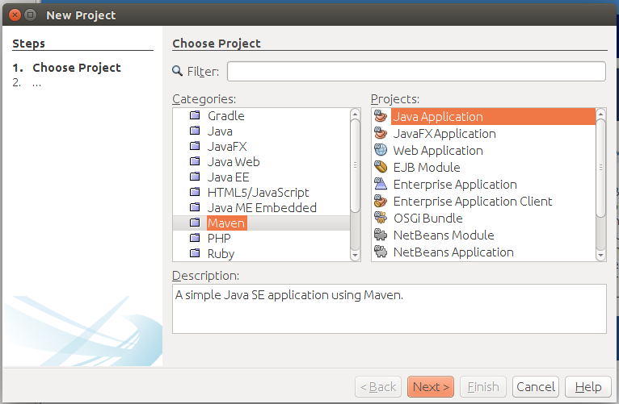
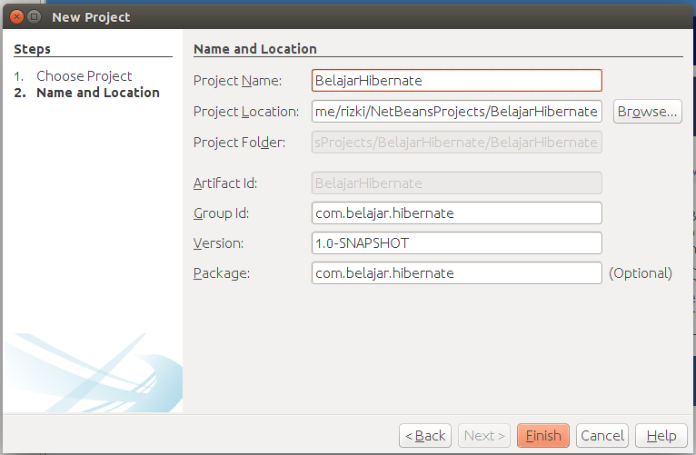

##Membuat Project

Berikut adalah tahapan untuk membuat project hibernate dengan menggunakan netbeans.

* Buka netbeans anda kemudian pilih menu **new project**, pada bagian categories pilih **maven**, dan pada bagian project pilih **java application** seperti berikut.

* Klik next, pada bagian project name isikan dengan **BelajarHibernate**.
* Pada bagian **Group ID** isikan dengan **com.belajar.hibernate**, Group ID ini berfungsi sebagai penamaan sebuah perusahaan atau organisasi yang membuat aplikasi.
* Pada bagian version biarkan saja dikarenakan aplikasi yang kita bangun masih tahap development maka versionnya default akan menjadi **1.0-SNAPSHOT**.
* Pada bagian **package** isikan dengan **com.belajar.hibernate** yang berfungsi sebagai nama package dari aplikasi yang akan kita buat nanti, lalu klik finish. Berikut adalah contoh pembuatan projectnya.

