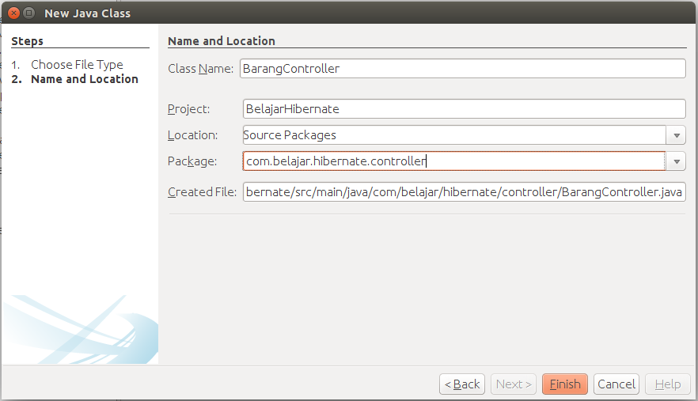

##Membuat Controller Barang

Setelah selesai kita akan lanjut ke bagian controller. Dibagian controller kita akan mengatur bagaimana cara menghubungkan antara model, dao dan juga view. Silahkan buat sebuah class baru seperti berikut.



Kemudian tambahkan codingan berikut ini pada class **BarangController** seperti berikut.

```java
package com.belajar.hibernate.controller;

import com.belajar.hibernate.configuration.BarangTableModel;
import com.belajar.hibernate.configuration.HibernateUtil;
import com.belajar.hibernate.dao.BarangDao;
import com.belajar.hibernate.model.Barang;
import com.belajar.hibernate.model.JenisBarang;
import com.belajar.hibernate.view.BarangView;
import java.text.ParseException;
import java.text.SimpleDateFormat;
import java.util.List;
import java.util.logging.Level;
import java.util.logging.Logger;
import javax.swing.JOptionPane;

/**
 * @Author Rizki Mufrizal
 * @Since Dec 8, 2015
 */
public class BarangController {

    private final BarangView barangView;
    private BarangTableModel barangTableModel;
    private List<Barang> barangs;

    private final BarangDao barangDao = HibernateUtil.getBarangDao();

    public BarangController(BarangView barangView) {
        this.barangView = barangView;
    }

    public void tampilData() {
        barangs = barangDao.getBarangs();
        barangTableModel = new BarangTableModel(barangs);
        this.barangView.getTabel().setModel(barangTableModel);
    }

    public void show() {
        int index = this.barangView.getTabel().getSelectedRow();
        this.barangView.getIdBarang().setText(String.valueOf(
            this.barangView.getTabel().getValueAt(index, 0)));
        this.barangView.getNamaBarang().setText(String.valueOf(
            this.barangView.getTabel().getValueAt(index, 1)));
        this.barangView.getJenisBarang().setText(String.valueOf(
            this.barangView.getTabel().getValueAt(index, 2)));
        this.barangView.getTanggalKadaluarsa().setText(String.valueOf(
            this.barangView.getTabel().getValueAt(index, 3)));
    }

    public void clear() {
        this.barangView.getIdBarang().setText("");
        this.barangView.getNamaBarang().setText("");
        this.barangView.getJenisBarang().setText("");
        this.barangView.getTanggalKadaluarsa().setText("");
    }

    public void saveBarang() {
        Barang barang = new Barang();
        barang.setNamaBarang(this.barangView.getNamaBarang().getText());
        barang.setJenisBarang(JenisBarang.valueOf(this.barangView
            .getJenisBarang().getText()));

        SimpleDateFormat dateFormat = new SimpleDateFormat("yyyy-MM-dd");

        try {
            barang.setTanggalKadaluarsa(dateFormat.parse(this.barangView
                .getTanggalKadaluarsa().getText()));
        } catch (ParseException ex) {
            Logger.getLogger(BarangController.class.getName()).log(Level
                .SEVERE, null, ex);
        }

        barangDao.save(barang);

        JOptionPane.showMessageDialog(null, "Data Berhasil di Simpan", "info", 
        JOptionPane.INFORMATION_MESSAGE);
        clear();
        tampilData();
    }

    public void updateBarang() {
        Barang barang = new Barang();
        barang.setIdBarang(this.barangView.getIdBarang().getText());
        barang.setNamaBarang(this.barangView.getNamaBarang().getText());
        barang.setJenisBarang(JenisBarang.valueOf(this.barangView
            .getJenisBarang().getText()));

        SimpleDateFormat dateFormat = new SimpleDateFormat("yyyy-MM-dd");

        try {
            barang.setTanggalKadaluarsa(dateFormat.parse(this.barangView
                .getTanggalKadaluarsa().getText()));
        } catch (ParseException ex) {
            Logger.getLogger(BarangController.class.getName()).log(
                Level.SEVERE, null, ex);
        }

        barangDao.update(barang);

        JOptionPane.showMessageDialog(null, "Data Berhasil di Edit", "info",
         JOptionPane.INFORMATION_MESSAGE);
        clear();
        tampilData();
    }

    public void deleteBarang() {

        if (this.barangView.getIdBarang().getText() == null) {
            JOptionPane.showMessageDialog(null, "Barang belum dipilih", "error",
             JOptionPane.ERROR_MESSAGE);
        } else {
            Barang barang = new Barang();
            barang.setIdBarang(this.barangView.getIdBarang().getText());

            int pilih = JOptionPane.showConfirmDialog(null, 
                "Apakah data ingin dihapus ?", "Warning", 
                JOptionPane.YES_NO_OPTION, JOptionPane.WARNING_MESSAGE);

            if (pilih == JOptionPane.YES_OPTION) {
                barangDao.delete(barang);

                JOptionPane.showMessageDialog(null, 
                    "Data Berhasil di Hapus", "info", 
                    JOptionPane.INFORMATION_MESSAGE);
                clear();
                tampilData();
            }
        }
    }
}
```

Kemudian silahkan buka lagi **BarangView** untuk melakukan implementasi coding dari bagian controller ke bagian view. Silahkan ganti dari menu design ke menu source. Tepat dibagian bawah class **BarangView** silahkan deklarasikan sebuah variabel seperti berikut ini.

```java
public class BarangView extends javax.swing.JFrame {

    private final BarangController barangController = new BarangController(this);

    // other resource

}
```

kemudian kita ingin pada saat aplikasi dijalankan, data akan ditampilkan di dalam JTable maka agar dapat ditampilkan kita akan memanggil method show data yang berasal dari class controller. Pemanggilan ini kita deklarasikan di dalam constructor class. Berikut adalah codingan untuk bagian constructor.

```java
public BarangView() {
    initComponents();
    barangController.tampilData();
}
```

Kemudian pindah ke menu design, silahkan klik 2x pada button simpan sehingga akan muncul kodingan, silahkan sesuaikan codingannya seperti berikut.

```java
private void simpanActionPerformed(java.awt.event.ActionEvent evt) {
    barangController.saveBarang();
}
```

Untuk button update juga sama seperti button simpan, berikut adalah codingannya.

```java
private void updateActionPerformed(java.awt.event.ActionEvent evt) {
    barangController.updateBarang();
}
```

untuk button delete seperti berikut.

```java
private void hapusActionPerformed(java.awt.event.ActionEvent evt) {
    barangController.deleteBarang();
} 
```

tahap terakhir adalah ketika tabel diklik maka isian pada row tabel yang dipilih akan ditampilkan di dalam masing - masing text field. Silahkan klik kanan pada tabel lalu pilih events lalu pilih mouse dan pilih mouseclicked. Kemudian masukkan codingan berikut.

```java
private void tabelMouseClicked(java.awt.event.MouseEvent evt) {
    barangController.show();
}   
```