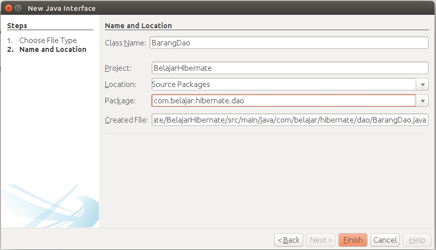

##Membuat Dao Barang

sebelumnya kita telah membuatkan sebuah model, di dalam model hanya berfungsi sebagai mapping ke database, sedangkan ketika kita ingin melakukan query ke database, kita diwajibkan membuat class DAO (data access object) dimana DAO ini hanya akan melakukan query ke database, semua yang berhubungan dengan query ke database akan dilakukan pada bagian DAO. Sehingga jika kita membuat project hibernate maka DAO secara tidak langsung akan menjadi penghubung antara controller dengan model.

Untuk membuat DAO, maka kita akan membuat 2 class, yang pertama adalah class interface dan yang kedua adalah class yang akan melakukan implementasi terhadap class sebelumnya. Silahkan klik kanan pada project lalu pilih new dan pilih java interface lalu isikan seperti berikut.



Kemudian tambahkan kodingan seperti berikut ini.

```java
package com.belajar.hibernate.dao;

import com.belajar.hibernate.model.Barang;
import java.util.List;

/**
 * @Author Rizki Mufrizal
 * @Since Dec 6, 2015
 */
public interface BarangDao {

    public void save(Barang barang);

    public void update(Barang barang);

    public void delete(Barang barang);

    public Barang getBarang(String idBarang);

    public List<Barang> getBarangs();
}

```

pada class ini penulis mendeklarasikan method - method yang akan digunakan oleh aplikasi nantinya. Untuk melakukan implementasinya maka kita buat sebuah class lagi dengan cara klik kanan pada project lalu pilih java class dan isikan seperti berikut.


Setelah selesai, tahap selanjutnya adalah tambahkan codingan pada class **BarangDaoImpl** seperti berikut :

```java
package com.belajar.hibernate.dao;

import com.belajar.hibernate.model.Barang;
import java.util.List;
import org.hibernate.Session;
import org.hibernate.SessionFactory;

/**
 * @Author Rizki Mufrizal
 * @Since Dec 6, 2015
 */
public class BarangDaoImpl implements BarangDao {

    private final SessionFactory sessionFactory;

    public BarangDaoImpl(SessionFactory sessionFactory) {
        this.sessionFactory = sessionFactory;
    }

    @Override
    @SuppressWarnings("ConvertToTryWithResources")
    public void save(Barang barang) {
        Session session = sessionFactory.openSession();
        try {
            session.beginTransaction();
            session.save(barang);
            session.getTransaction().commit();
        } catch (Exception e) {
            session.getTransaction().rollback();
        } finally {
            session.close();
        }
    }

    @Override
    @SuppressWarnings("ConvertToTryWithResources")
    public void update(Barang barang) {
        Session session = sessionFactory.openSession();
        try {
            session.beginTransaction();
            session.update(barang);
            session.getTransaction().commit();
        } catch (Exception e) {
            session.getTransaction().rollback();
        } finally {
            session.close();
        }
    }

    @Override
    @SuppressWarnings("ConvertToTryWithResources")
    public void delete(Barang barang) {
        Session session = sessionFactory.openSession();
        try {
            session.beginTransaction();
            session.delete(barang);
            session.getTransaction().commit();
        } catch (Exception e) {
            session.getTransaction().rollback();
        } finally {
            session.close();
        }
    }

    @Override
    @SuppressWarnings("ConvertToTryWithResources")
    public Barang getBarang(String idBarang) {
        Session session = sessionFactory.openSession();
        try {
            session.beginTransaction();
            Barang barang = session.get(Barang.class, idBarang);
            session.getTransaction().commit();
            return barang;
        } catch (Exception e) {
            session.getTransaction().rollback();
            return null;
        } finally {
            session.close();
        }
    }

    @Override
    @SuppressWarnings("ConvertToTryWithResources")
    public List<Barang> getBarangs() {
        Session session = sessionFactory.openSession();
        try {
            session.beginTransaction();
            List<Barang> barangs = session.createCriteria(Barang.class).list();
            session.getTransaction().commit();
            return barangs;
        } catch (Exception e) {
            session.getTransaction().rollback();
            return null;
        } finally {
            session.close();
        }
    }

}
```

masing - masing method tersebut merupakan implementasi dari class **BarangDao** dimana setiap method tersebut diimplementasi berdasarkan fungsinya. Dikarenakan disini penulis tidak menggunakan spring maka kita diwajibkan menggunakan **transaction** secara manual, penjelasan tentang transaction akan dijelaskan lebih lanjut pada bab spring. Berikut adalah penjelasan mengenai beberapa kodingan diatas :

```java
    private final SessionFactory sessionFactory;
```

merupakan class **interface** dimana class ini akan diinject ke dalam konfigurasi **hibernate**, penjelasan mengenai inject akan dijelaskan pada bab spring.

```java
    public BarangDaoImpl(SessionFactory sessionFactory) {
        this.sessionFactory = sessionFactory;
    }
```

merupakan sebuah class **constructor** dimana untuk melakukan implementasi **dependency injection** kita bisa menggunakan class **constructor**.

```java
    @Override
    @SuppressWarnings("ConvertToTryWithResources")
    public void save(Barang barang) {
        Session session = sessionFactory.openSession();
        try {
            session.beginTransaction();
            session.save(barang);
            session.getTransaction().commit();
        } catch (Exception e) {
            session.getTransaction().rollback();
        } finally {
            session.close();
        }
    }
```

sintak **@Override** merupakan implementasi dari **inheritance** dimana **@Override** itu merupakan overriding atau sebuah method diturunkan dari orang tua ke anak tetapi method tersebut diimplementasikan berbeda dengan orang tuanya. sintak **session** berfungsi sebagai manipulasi data, sebernarnya class **session** ini juga diinject dengan menggunakan class **SessionFactory** jadi bisa dibilang bahwa session membutuhkan depent dari class **SessionFactory**. Sintak **session.beginTransaction();** berfungsi untuk memulai transaction dan tahap selanjutnya adalah dia menyimpan data dengan menggunakan variabel session. Dapat dilihat bahwa dengan menggunakan hibernate maka kita dapat dengan mudah melakukan manipulasi data dan OOP pada java akan terlihat jelas.