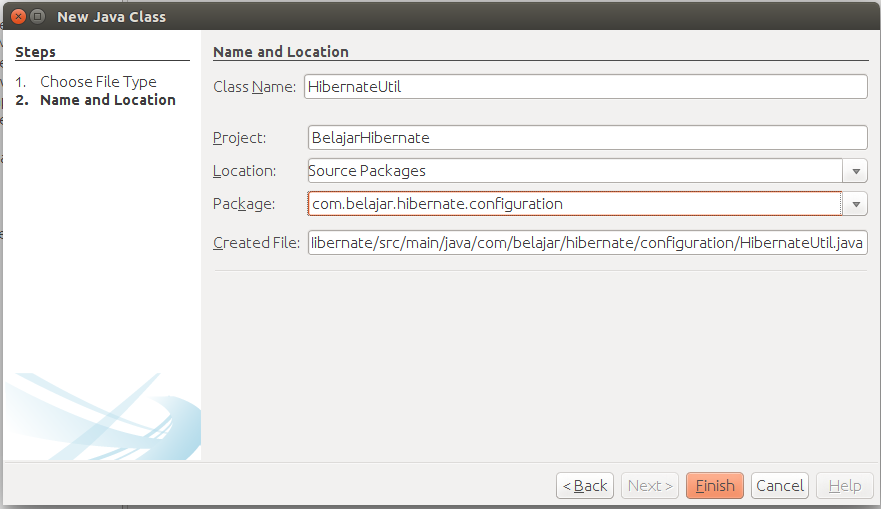

##Membuat Hibernate Util Dan Tabel Model

Langkah selanjutnya silahkan buat class baru seperti berikut ini.


setelah selesai kemudian masukkan codingan berikut ini.

```java
package com.belajar.hibernate.configuration;

import com.belajar.hibernate.model.Barang;
import java.util.ArrayList;
import java.util.List;
import javax.swing.table.AbstractTableModel;

/**
 * @Author Rizki Mufrizal
 * @Since Dec 7, 2015
 */
public class BarangTableModel extends AbstractTableModel {

    private List<Barang> barangs = new ArrayList<>();
    private final String HEADER[] = {"ID Barang", "Nama Barang", 
    "Jenis Barang", "Tanggal Kadaluarsa"};

    public BarangTableModel(List<Barang> barangs) {
        this.barangs = barangs;
    }

    @Override
    public int getRowCount() {
        return barangs.size();
    }

    @Override
    public int getColumnCount() {
        return HEADER.length;
    }

    @Override
    public String getColumnName(int columnIndex) {
        return HEADER[columnIndex];
    }

    @Override
    public Object getValueAt(int rowIndex, int columnIndex) {
        Barang barang = barangs.get(rowIndex);

        switch (columnIndex) {
            case 0:
                return barang.getIdBarang();
            case 1:
                return barang.getNamaBarang();
            case 2:
                return barang.getJenisBarang();
            case 3:
                return barang.getTanggalKadaluarsa();
            default:
                return null;
        }
    }

}

```

fungsi dari class diatas adalah untuk memberikan label untuk setiap column yang ada di dalam tabel. Nantinya kita akan membuat sebuah tabel dimana tabel tersebut berisikan data barang. Buatlah sebuah class untuk meload konfigurasi hibernate. Berikut adalah gambar untuk membuat class tersebut.



kemudian isikan dengan codingan berikut.

```java
package com.belajar.hibernate.configuration;

import com.belajar.hibernate.dao.BarangDao;
import com.belajar.hibernate.dao.BarangDaoImpl;
import org.hibernate.SessionFactory;
import org.hibernate.cfg.Configuration;

/**
 * @Author Rizki Mufrizal
 * @Since Dec 7, 2015
 */
public class HibernateUtil {

    private static final SessionFactory SESSION_FACTORY;
    private static final BarangDao BARANG_DAO;

    static {
        try {
            SESSION_FACTORY = new Configuration().configure()
            .buildSessionFactory();
            BARANG_DAO = new BarangDaoImpl(SESSION_FACTORY);
        } catch (Throwable ex) {
            System.err.println("Initial SessionFactory creation failed." + ex);
            throw new ExceptionInInitializerError(ex);
        }
    }

    public static SessionFactory getSessionFactory() {
        return SESSION_FACTORY;
    }

    public static BarangDao getBarangDao() {
        return BARANG_DAO;
    }
}
```