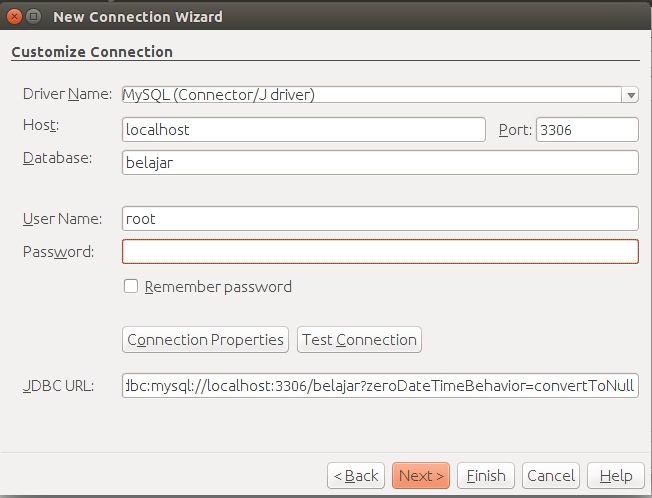

##Membuat Konfigurasi Hibernate

Klik kanan pada project lalu pilih new lalu pilih other, pada bagian categories pilih **hibernate** dan pada bagian **File Types** pilih **Hibernate Configuration Wizard**. Klik next dan biarkan filenya dengan nama **hibernate.cfg** klik next maka akan muncul seperti ini.


Pada tahap ini kita diharuskan membuat database terlebih dahulu, silahkan buka **phpmyadmin** anda lalu buatlah sebuah database dengan nama **belajar**. Setelah selesai, pada gambar diatas silahkan pilih **database connection** lalu pilih **New Database Connection** kemudian pada bagian driver pilih **mysql** klik next lalu isikan seperti berikut ini.



lalu untuk mengetes koneksi silahkan pilih **test connection**, klik next dan finish. Kemudian akan balik lagi ke konfigurasi hibernate dan klik finish agar konfigurasi hibernate digenerate oleh netbeans. Silahkan ganti dari menu design ke menu source kemudian ubah menjadi kodingan seperti berikut ini.

```xml
<?xml version="1.0" encoding="UTF-8"?>
<!DOCTYPE hibernate-configuration PUBLIC "-//Hibernate/Hibernate Configuration 
    DTD 3.0//EN" "http://hibernate.sourceforge.net/hibernate-configuration-3.0.dtd">
<hibernate-configuration>
  <session-factory>
    <property name="hibernate.dialect">
        org.hibernate.dialect.MySQLDialect
    </property>
    <property name="hibernate.connection.driver_class">
        com.mysql.jdbc.Driver
    </property>
    <property name="hibernate.connection.url">
        jdbc:mysql://localhost:3306/belajar?zeroDateTimeBehavior=convertToNull
    </property>
    <property name="hibernate.connection.username">root</property>
    <property name="hibernate.connection.password"></property>
    <property name="hibernate.hbm2ddl.auto">update</property>
    <property name="hibernate.show_sql">true</property>
    <property name="hibernate.format_sql">true</property>
    
    <mapping class="com.belajar.hibernate.model.Barang" />
  </session-factory>
</hibernate-configuration>
```

berikut penjelasan tentang konfigurasi diatas

- **hibernate.dialect** berfungsi untuk mendeklarasikan dialect apa yang akan digunakan, sesuaikan dengan type basis data yang digunakan.
- **hibernate.connection.driver_class** berfungsi untuk mendeklarasikan driver yang akan digunakan.
- **hibernate.connection.url** berfungsi untuk mendeklarasikan url ke sebuah basis data
- **hibernate.hbm2ddl.auto** terdapat beberapa fungsi diantaranya adalah
    * **Create** : Jika table sudah ada maka semua akan di drop dan dibuat ulang.
    * **Update** : jika table belum ada maka akan dibuat, jika tabel sudah ada maka hanya dilakukan update.
- **hibernate.show_sql** berfungsi untuk menampilkan sintak sql yang dilakukan oleh hibernate.
- **hibernate.format_sql** berfungsi untuk melakukan format sql sehingga mudah dibaca.
- **mapping** berfungsi untuk melakukan mapping terhadap class yang dituju, class disini berasal dari package model yang tadinya kita buat.

Kemudian untuk menjalankan aplikasi silahkan klik kanan pada class **BarangView** lalu run file atau dengan shortcut **shift + f6**. Berikut adalah hasilnya.

