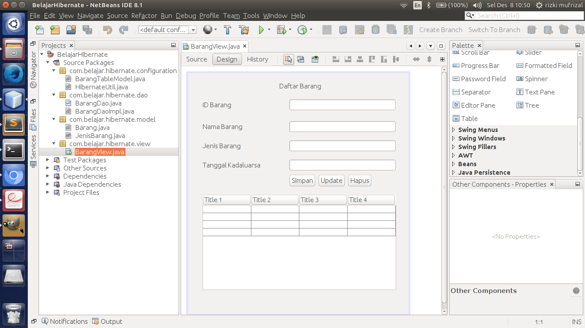
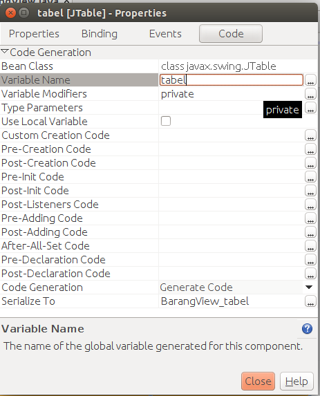

##Membuat View Barang

Langkah selanjutnya adalah kita membuat view terlebih dahulu, mengapa demikian ? dikarenakan controller hanya sebagai penghubung antara view dan model sehingga kita diharuskan membuat view terlebih dahulu. Untuk membuat view silahkan klik kanan pada project anda lalu pilih JFrame Form seperti gambar berikut ini.

kemudian drag drop component pada menu palette, pilih pada bagian swing containers dan swing control karena kita hanya menggunakan komponent swing tanpa menggunakan AWT. Silahkan buat tampilan seperti berikut ini.

Selanjutnya kita akan mengubah name dari setiap component yang telah kita buat tadi. silahkan pilih salah satu component misalnya disini penulis memilih component tabel, klik kanan pada tabel tersebut kemudian pilih properties. Pilih pada tab **code**, pada bagian variable name ubah menjadi **tabel** seperti berikut ini.

kemudian ubah juga untuk setiap component lainnya, berikut adalah daftar yang perlu anda ubah.

| Component   | Name              |
|:------------|:------------------|
|JTextField 1 | idBarang          |
|JTextField 2 | namaBarang        |
|JTextField 3 | jenisBarang       |
|JTextField 4 | tanggalKadaluarsa |
|JButton 1    | simpan            |
|JButton 2    | update            |
|JButton 3    | hapus             |
|JTable 1     | tabel             |

kemudian lakukan refactor terhadap component tersebut seperti halnya class **Barang** di dalam package model.