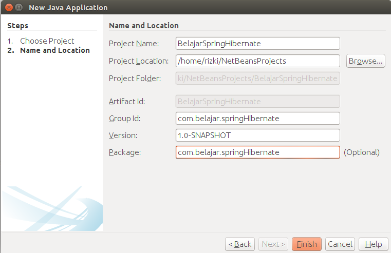

# Membuat Project Spring Dan Hibernate

Pada bagian ini kita akan membuat dan malakukan konfigurasi project dengan menggunakan framework spring dan hibernate. Apa perbedaan antara spring dan hibernate ? apakah spring dan hibernate dapat digabung menjadi sebuah project ?

Hibernate adalah framework yang berbasis ORM sehingga hibernate akan mengurus semua masalah yang bersangkutan dengan basis data atau database sedangkan spring adalah framework yang berbasis dependency injection sehingga memudahkan dalam melakukan manajemen terhadap sebuah object. Spring dan hibernate merupakan dua framework yang memiliki konsep yang berbeda akan tetapi kedua framework ini dapat digabungkan karena salah satu dari mereka membutuhkan framework yang lain. Jika kita menggunakan framework hibernate tanpa menggunakan framework spring ibaratnya seperti kita makan nasi tanpa lauk, mengapa demikian ? karena dengan menggunakan spring maka project yang akan dibangun semakin baik, rapi, dan salah satu keunggulannya adalah konsep AOP sehingga mempermudah transaction management. Mungkin agak sedikit bingung tentang penjelasan AOP, nanti akan dibahas pada bagian implementasi project spring dan hibernate.

##Membuat Project

Sama seperti sebelumnya klik menu `new project` lalu pada bagian categories pilih `maven` dan pada bagian project pilih `java application`. Berikut adalah gambar konfigurasinya



Kemudian buka file `pom.xml` berikut adalah konfigurasinya

```xml
<?xml version="1.0" encoding="UTF-8"?>
<project xmlns="http://maven.apache.org/POM/4.0.0" xmlns:xsi="http://www.w3.org/2001/XMLSchema-instance" xsi:schemaLocation="http://maven.apache.org/POM/4.0.0 http://maven.apache.org/xsd/maven-4.0.0.xsd">
    <modelVersion>4.0.0</modelVersion>
    <groupId>com.belajar.springHibernate</groupId>
    <artifactId>BelajarSpringHibernate</artifactId>
    <version>1.0-SNAPSHOT</version>
    <packaging>jar</packaging>
    <properties>
        <project.build.sourceEncoding>UTF-8</project.build.sourceEncoding>
        <maven.compiler.source>1.8</maven.compiler.source>
        <maven.compiler.target>1.8</maven.compiler.target>
    </properties>
    
    <dependencies>
        <!-- hibernate -->
        <dependency>
            <groupId>org.hibernate</groupId>
            <artifactId>hibernate-core</artifactId>
            <version>5.0.4.Final</version>
        </dependency>
        <dependency>
            <groupId>org.hibernate</groupId>
            <artifactId>hibernate-entitymanager</artifactId>
            <version>4.3.1.Final</version>
        </dependency>
        
        <!-- mysql -->
        <dependency>
            <groupId>mysql</groupId>
            <artifactId>mysql-connector-java</artifactId>
            <version>5.1.37</version>
        </dependency>
        
        <!-- spring -->
        <dependency>
            <groupId>org.springframework</groupId>
            <artifactId>spring-core</artifactId>
            <version>4.2.3.RELEASE</version>
        </dependency>

        <dependency>
            <groupId>org.springframework</groupId>
            <artifactId>spring-context</artifactId>
            <version>4.2.3.RELEASE</version>
        </dependency>

        <dependency>
            <groupId>org.springframework</groupId>
            <artifactId>spring-orm</artifactId>
            <version>4.2.3.RELEASE</version>
        </dependency>

        <dependency>
            <groupId>org.springframework</groupId>
            <artifactId>spring-jdbc</artifactId>
            <version>4.2.3.RELEASE</version>
        </dependency>

        <dependency>
            <groupId>org.springframework</groupId>
            <artifactId>spring-tx</artifactId>
            <version>4.2.3.RELEASE</version>
        </dependency>
    </dependencies>
    
</project>
```

Karena kita akan menggunakan framework hibernate dan spring maka kita membutuhkan beberapa 
