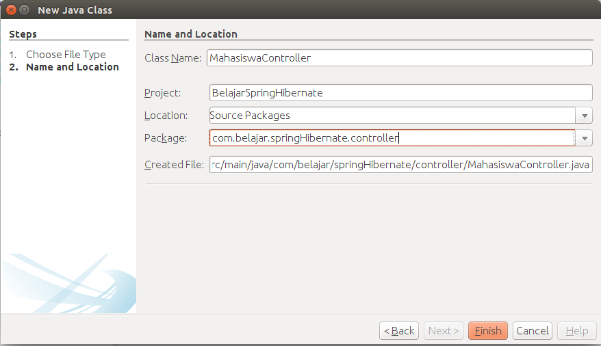

## Membuat Controller Mahasiswa

Setelah selesai pada bagian view, langkah selanjutnya adalah membuat controller. Controller disini akan kita gunakan untuk mengontrol antara model dan view. Kemudian buatlah sebuah class `MahasiswaController` seperti berikut ini.



Kemudian masukkan kodingan seperti berikut ini.

```java
package com.belajar.springHibernate.controller;

import com.belajar.springHibernate.App;
import com.belajar.springHibernate.configuration.MahasiswaTableModel;
import com.belajar.springHibernate.model.Mahasiswa;
import com.belajar.springHibernate.view.MahasiswaView;
import java.util.List;
import javax.swing.JOptionPane;

/**
 * @Author Rizki Mufrizal
 * @Since Dec 17, 2015
 */
public class MahasiswaController {
    
    private final MahasiswaView mahasiswaView;
    private MahasiswaTableModel mahasiswaTableModel;
    private List<Mahasiswa> mahasiswas;

    public MahasiswaController(MahasiswaView mahasiswaView) {
        this.mahasiswaView = mahasiswaView;
    }

    public void tampilData() {
        mahasiswas = App.getMahasiswaService().getMahasiswas();
        mahasiswaTableModel = new MahasiswaTableModel(mahasiswas);
        this.mahasiswaView.getTabel().setModel(mahasiswaTableModel);
    }

    public void show() {
        int index = this.mahasiswaView.getTabel().getSelectedRow();
        this.mahasiswaView.getNpm().setText(String.valueOf(
            this.mahasiswaView.getTabel().getValueAt(index, 0)));
        this.mahasiswaView.getNama().setText(String.valueOf(
            this.mahasiswaView.getTabel().getValueAt(index, 1)));
        this.mahasiswaView.getKelas().setText(String.valueOf(
            this.mahasiswaView.getTabel().getValueAt(index, 2)));
        this.mahasiswaView.getAlamat().setText(String.valueOf(
            this.mahasiswaView.getTabel().getValueAt(index, 3)));
    }

    public void clear() {
        this.mahasiswaView.getNpm().setText("");
        this.mahasiswaView.getNama().setText("");
        this.mahasiswaView.getKelas().setText("");
        this.mahasiswaView.getAlamat().setText("");
    }

    public void saveMahasiswa() {
        Mahasiswa mahasiswa = new Mahasiswa();
        mahasiswa.setNpm(this.mahasiswaView.getNpm().getText());
        mahasiswa.setNama(this.mahasiswaView.getNama().getText());
        mahasiswa.setKelas(this.mahasiswaView.getKelas().getText());
        mahasiswa.setAlamat(this.mahasiswaView.getAlamat().getText());

        App.getMahasiswaService().save(mahasiswa);

        JOptionPane.showMessageDialog(null, "Data Berhasil di Simpan", "info", 
        JOptionPane.INFORMATION_MESSAGE);
        clear();
        tampilData();
    }

    public void updateMahasiswa() {
        Mahasiswa mahasiswa = new Mahasiswa();
        mahasiswa.setNpm(this.mahasiswaView.getNpm().getText());
        mahasiswa.setNama(this.mahasiswaView.getNama().getText());
        mahasiswa.setKelas(this.mahasiswaView.getKelas().getText());
        mahasiswa.setAlamat(this.mahasiswaView.getAlamat().getText());

        App.getMahasiswaService().update(mahasiswa);

        JOptionPane.showMessageDialog(null, "Data Berhasil di Edit", "info", 
        JOptionPane.INFORMATION_MESSAGE);
        clear();
        tampilData();
    }

    public void deleteMahasiswa() {

        if (this.mahasiswaView.getNpm().getText() == null) {
            JOptionPane.showMessageDialog(null, "Mahasiswa belum dipilih", "error", 
            JOptionPane.ERROR_MESSAGE);
        } else {
            Mahasiswa mahasiswa = new Mahasiswa();
            mahasiswa.setNpm(this.mahasiswaView.getNpm().getText());

            int pilih = JOptionPane.showConfirmDialog(null, 
                "Apakah data ingin dihapus ?", "Warning", 
                JOptionPane.YES_NO_OPTION, JOptionPane.WARNING_MESSAGE);

            if (pilih == JOptionPane.YES_OPTION) {
                App.getMahasiswaService().delete(mahasiswa);

                JOptionPane.showMessageDialog(null, "Data Berhasil di Hapus", "info", 
                JOptionPane.INFORMATION_MESSAGE);
                clear();
                tampilData();
            }
        }
    }
}
```

Bisa dilihat bahwa terdapat error yaitu pada bagian variabel `App` dikarenakan kita belum membuat class `App`. Class `App` nantinya akan dibuat setelah kita melakukan konfigurasi pada bagian `view`. Silahkan buka kembali `MahasiswaView` kemudian ubah codingan pada bagian.

```java
public class MahasiswaView extends javax.swing.JFrame {

    private final MahasiswaController mahasiswaController = new MahasiswaController(this);
    
    //other resource   
}
```

Kemudian untuk menampilkan data silahkan ubah codingan menjadi seperti berikut ini.

```java
public MahasiswaView() {
    initComponents();
    mahasiswaController.tampilData();
}
```

Untuk menyimpan data mahasiswa kita akan mengaktfikan fungsi dari button save, klik dua kali pada button save kemudian masukkan codingan sepeti berikut ini.

```java
private void simpanActionPerformed(java.awt.event.ActionEvent evt) {
    mahasiswaController.saveMahasiswa();
}
```

Langkah selanjutnya adalah untuk dapat mengubah data maka kita akan aktifkan button update, silahkan klik dua kali pada button update kemudian masukkan codingan seperti berikut ini.

```java
private void updateActionPerformed(java.awt.event.ActionEvent evt) {
    mahasiswaController.updateMahasiswa();
}                                     
```

tahap selanjutnya adalah untuk menghapus data juga sama seperti sebelumnya klik dua kali pada button delete dan masukkan codingan berikut ini.

```java
private void hapusActionPerformed(java.awt.event.ActionEvent evt) {
    mahasiswaController.deleteMahasiswa();
}
```

Tahap terakhir adalah untuk menampilkan data pada masing - masing text field maka kita harus membuat action pada bagian tabel, silahkan klik kanan pada tabel lalu pilih events lalu pilih mouse dan pilih mouseclicked. Kemudian masukkan codingan berikut.

```java
private void tabelMouseClicked(java.awt.event.MouseEvent evt) {
    mahasiswaController.show();
}
```