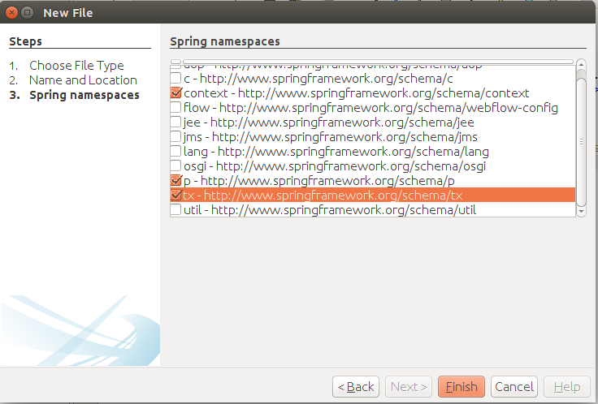
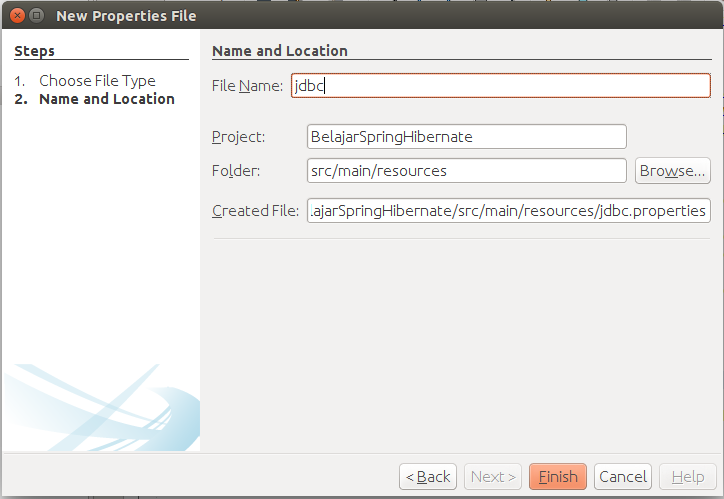
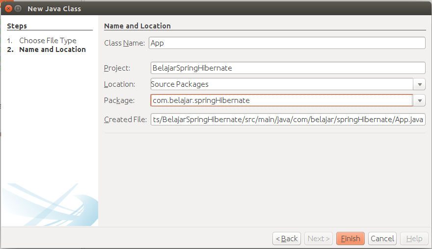
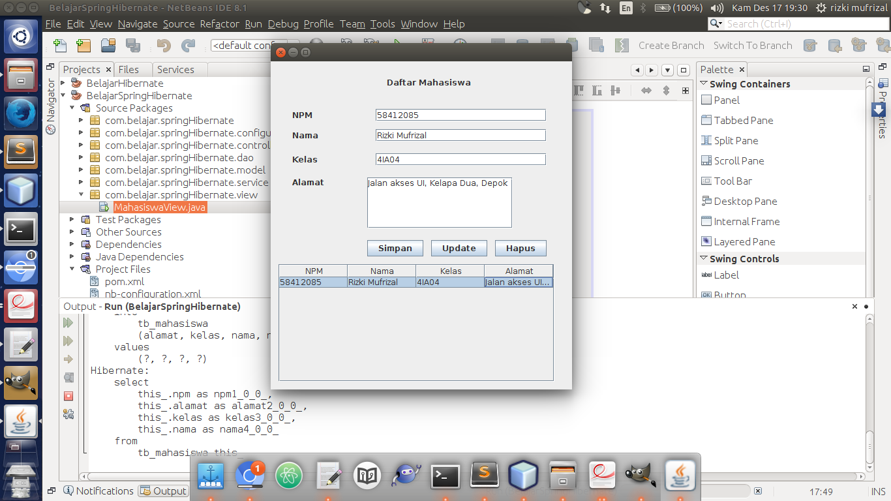

# Membuat Konfigurasi Hibernate Dan Spring

Konfigurasi yang pertama kali kita buat adalah konfigurasi hibernate, untuk konfigurasi hibernate silahkan dilihat pada bab sebelumnya. Pada file `hibernate.cfg.xml` ubah menjadi seperti berikut.

```xml
<?xml version="1.0" encoding="UTF-8"?>
<!DOCTYPE hibernate-configuration PUBLIC "-//Hibernate/Hibernate Configuration 
    DTD 3.0//EN" "http://hibernate.sourceforge.net/hibernate-configuration-3.0.dtd">
<hibernate-configuration>
    <session-factory>
        <property name="hibernate.dialect">org.hibernate.dialect.MySQLDialect</property>
        <property name="hibernate.hbm2ddl.auto">update</property>
        <property name="hibernate.show_sql">true</property>
        <property name="hibernate.format_sql">true</property>
        
        <mapping class="com.belajar.springHibernate.model.Mahasiswa" />
    </session-factory>
</hibernate-configuration>

```

Bisa dilihat bahwa konfigurasi `hibernate` disini tidak mendeklarasikan koneksi ke database akan tetapi konfigurasu koneksi database akan dilakukan pada bagian spring. Tahap selanjutnya adalah membuat konfigurasi spring, 

silahkan klik kanan pada `<default package>` yang berada pada `other sources` kemudian pilih `new` kemudian pilih `other`. Pada bagian `categories` pilih menu `other`, pada bagian `file types` pilih `spring xml config`. Klik next lalu pada bagian file name diisi dengan `spring-configuration`. Klik next lagi, kemudian pada bagian `spring namespace` check list pada `context`, `p` dan `tx` seperti gambar berikut.



Setelah selesai kemudian ubah codingan pada konfigurasi spring seperti berikut ini.

```xml
<?xml version="1.0" encoding="UTF-8"?>
<beans xmlns="http://www.springframework.org/schema/beans"
       xmlns:xsi="http://www.w3.org/2001/XMLSchema-instance"
       xmlns:context="http://www.springframework.org/schema/context"
       xmlns:p="http://www.springframework.org/schema/p"
       xmlns:tx="http://www.springframework.org/schema/tx"

       xsi:schemaLocation="http://www.springframework.org/schema/beans 
       http://www.springframework.org/schema/beans/spring-beans-4.2.xsd
          http://www.springframework.org/schema/context 
          http://www.springframework.org/schema/context/spring-context-4.2.xsd
          http://www.springframework.org/schema/tx 
          http://www.springframework.org/schema/tx/spring-tx-4.2.xsd">

    <context:annotation-config />
    <tx:annotation-driven transaction-manager="transactionManager" />
    
    <context:component-scan base-package="com.belajar.springHibernate" />
    <context:property-placeholder location="classpath:jdbc.properties" />
    
    <bean id="dataSource" class="org.springframework.jdbc.datasource.DriverManagerDataSource" 
        p:driverClassName="${jdbc.driver}"
        p:url="${jdbc.url}"
        p:username="${jdbc.username}"
        p:password="${jdbc.password}"
    />
    
    <bean id="sessionFactory" class="org.springframework.orm.hibernate5.LocalSessionFactoryBean"
        p:dataSource-ref="dataSource"
        p:configLocation="classpath:hibernate.cfg.xml"
    />
    
    <bean id="transactionManager" class="org.springframework.orm.hibernate5.HibernateTransactionManager" 
        p:sessionFactory-ref="sessionFactory"
    />
    
</beans>
```

Berikut adalah penjelasan singkat mengenai beberapa konfigurasi diatas.

* `context:annotation-config` : berfungsi untuk memberitahukan spring bahwa pada project yang kita buat akan menggunakan annotation sebagai konfigurasinya.
* `tx:annotation-driven` : berfungsi untuk memberitahukan spring bahwa kita menggunakan annotation `@Transaction` untuk transaction management.
* `context:component-scan` : berfungsi untuk mendefinisikan class - class mana saja yang menggunakan annotation `@Repository`, `@Service` sehingga class - class tersebut akan dimanage oleh spring.
* `context:property-placeholder` : berfungsi untuk memanggil file properties, biasanya file properties ini berisi konfigurasi koneksi ke database. Agar konfigurasinya jalan maka kita harus membuat file propertiesnya, silahkan klik kanan pada `<default package>` yang berada pada `other sources` kemudian pilih other. Pada `categories` pilih other lalu pada bagian `file types` pilih `properties file`. Kemudian beri nama dengan `jdbc` seperti berikut.



Kemudian pada file tersebut ubah kodingannya menjadi seperti berikut ini.

```properties
#
# @Author Rizki Mufrizal
# @Since Dec 17, 2015
#

jdbc.driver = com.mysql.jdbc.Driver
jdbc.url = jdbc:mysql://localhost:3306/belajar
jdbc.username = root
jdbc.password =
```

* `bean id="dataSource"` : bean yang berfungsi untuk deklarasi koneksi ke database, bisa dilihat bahwa pada bagian ini kita memanggil property - property dari file properties yang telah kita buat tadi misalnya `${jdbc.driver}` artinya kita memanggil isi dari `jdbc.driver` yang berasal dari file properties yang telah kita buat.
* `bean id="sessionFactory"` : bean ini berfungsi untuk melakukan inject ke property `SessionFactory` yang pernah kita deklarasikan sebelumnya di dalam class dao. Karena menggunakan spring maka object session factory yang ada di dalam class dao otomatis akan diinject ke bean session factory atau bisa dikatakan bahwa property session factory yang ada di dalam class dao membutuhkan depent dari bean session factory. Property yang diset pada bean session factory adalah `datasource` yang berfungsi untuk memanggil koneksi database kemudian `configLocation` yang berfungsi untuk memanggil konfigurasi hibernate, prefix `classpath` berarti konfigurasi database berada classpath atau berada pada folder `src/main/resources/`.
* `bean id="transactionManager"` merupakan bean yang berfungsi untuk memanage transaction pada hibernate.

Tahap terakhir adalah membuat sebuah class main untuk meload semuanya, silahkan buat sebuah class dengan nama `App` seperti berikut ini.



kemudian ubah codingannya seperti berikut ini.

```java
package com.belajar.springHibernate;

import com.belajar.springHibernate.service.MahasiswaService;
import com.belajar.springHibernate.view.MahasiswaView;
import org.springframework.context.ApplicationContext;
import org.springframework.context.support.ClassPathXmlApplicationContext;

/**
 * @Author Rizki Mufrizal
 * @Since Dec 17, 2015
 */
public class App {

    private static ApplicationContext applicationContext;

    public static void main(String[] args) {
        applicationContext = new 
        ClassPathXmlApplicationContext("classpath:spring-configuration.xml");
        new MahasiswaView().setVisible(true);
    }

    public static MahasiswaService getMahasiswaService() {
        return (MahasiswaService) applicationContext.getBean("MahasiswaService");
    }

}
```

Setelah selesai silahkan klik kanan pada class `App` kemudian pilih run, berikut adalah output dari aplikasinya.

