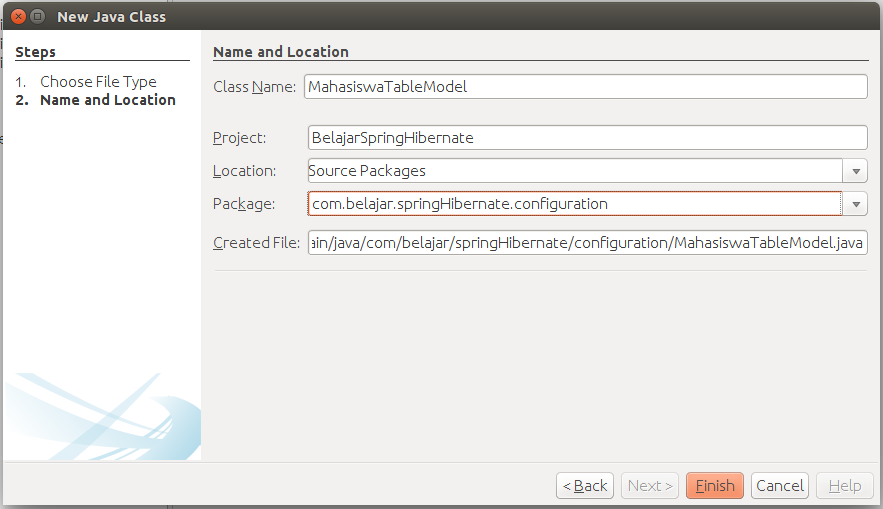

##Membuat Tabel Model

Jika membuat project dengan menggunakan hibernate maka kita membutuhkan konfigurasi class `hibernate util` dan `tabel model` sedangkan jika menggunakan framework `hibernate` dan `spring` maka kita hanya butuh konfigurasi `tabel model` untuk menampilkan data pada `JTable`. Konfigurasi hibernate nantinya akan kita load melalui konfigurasi spring maka kita tidak memerlukan konfigurasi `Hibernate Util`. Silahkan buat sebuah class dengan nama `MahasiswaTableModel` seperti berikut ini.

 

Kemudian ubah codingannya seperti berikut ini.

```java
package com.belajar.springHibernate.configuration;

import com.belajar.springHibernate.model.Mahasiswa;
import java.util.ArrayList;
import java.util.List;
import javax.swing.table.AbstractTableModel;

/**
 * @Author Rizki Mufrizal
 * @Since Dec 16, 2015
 */
public class MahasiswaTableModel extends AbstractTableModel {

    private List<Mahasiswa> mahasiswas = new ArrayList<>();
    private final String HEADER[] = {"NPM", "Nama", "Kelas", "Alamat"};

    public MahasiswaTableModel(List<Mahasiswa> mahasiswas) {
        this.mahasiswas = mahasiswas;
    }

    @Override
    public int getRowCount() {
        return mahasiswas.size();
    }

    @Override
    public int getColumnCount() {
        return HEADER.length;
    }

    @Override
    public String getColumnName(int columnIndex) {
        return HEADER[columnIndex];
    }

    @Override
    public Object getValueAt(int rowIndex, int columnIndex) {
        Mahasiswa mahasiswa = mahasiswas.get(rowIndex);
        switch (columnIndex) {
            case 0:
                return mahasiswa.getNpm();
            case 1:
                return mahasiswa.getNama();
            case 2:
                return mahasiswa.getKelas();
            case 3:
                return mahasiswa.getAlamat();
            default:
                return null;
        }
    }
}
 ```