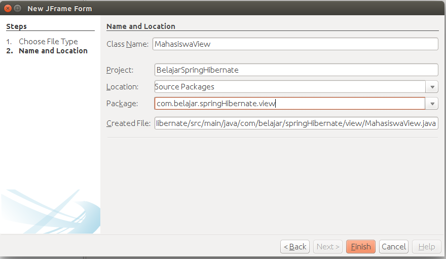
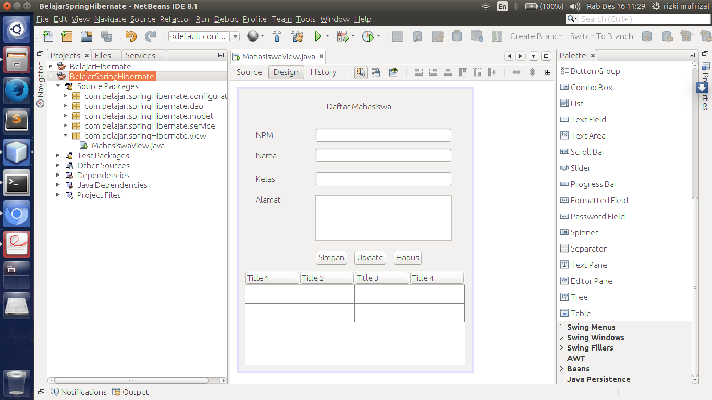

## Membuat View Mahasiswa

Setelah membuat tabel model, langkah selanjutnya adalah kita akan membuat view. Silahkan anda membuat sebuah view dengan nama `MahasiswaView` seperti berikut ini.

Kemudian lakukan design terhadap view tersebut seperti berikut ini.

Pada masing - masing component ubah seperti berikut ini.

| Component   | Name              |
|:------------|:------------------|
|JTextField 1 | npm               |
|JTextField 2 | nama              |
|JTextField 3 | kelas             |
|JTextArea 1  | alamat            |
|JButton 1    | simpan            |
|JButton 2    | update            |
|JButton 3    | hapus             |
|JTable 1     | tabel             |

Kemudian lakukan refactor terhadap component tersebut.